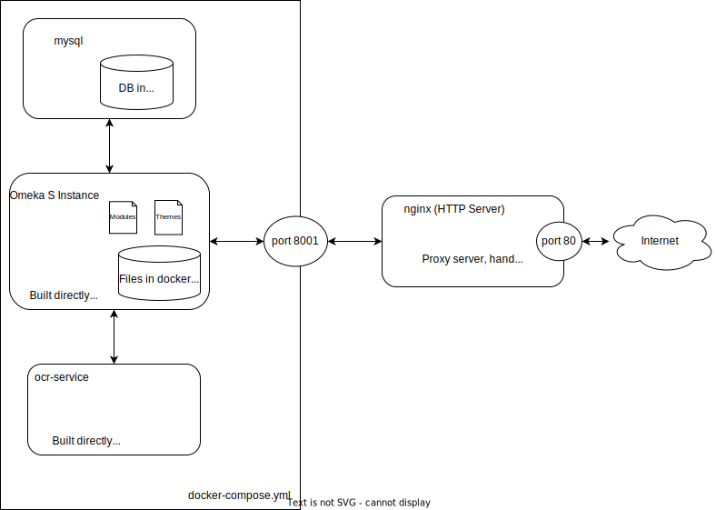

# Digital Archive

This is code to easily deploy an Omeka S instance and an automatic OCR service which periodically process uploaded PDFs.



## Pre-requisites

- Docker install (for instance for Ubuntu https://docs.docker.com/engine/install/ubuntu/)
- Docker-compose install (see https://docs.docker.com/compose/install/)
- nginx installed (`sudo apt install nginx` or equivalent)

## Start the service

Assuming docker-compose is properly installed, just run `docker-compose up -d --build` in this folder to (re)start the deployment.

The Omeka S instance is then accessible locally on port 8001.

In order for the port 8001 to be accessible from the outside, one should modify the `nginx` configuration by modifying the corresponding part of the `/etc/nginx/sites-available/default` file with the following snippet
```
location / {
        proxy_pass_header Server;
        proxy_set_header X-Real-IP $remote_addr;
        proxy_set_header X-Scheme $scheme;
        proxy_set_header X-Forwarded-For $proxy_add_x_forwarded_for;
        proxy_set_header X-Forwarded-Proto $scheme;
        proxy_set_header Host $http_host;
        proxy_redirect off;

        proxy_pass http://127.0.0.1:8001;
        # Max file upload size
        client_max_body_size 100M;
}
```

Then restart the nginx server with `sudo service nginx restart`, the Omeka S instance should now be accessible from the outside world directly.


## Add modules in Omeka S

Modules have to be downloaded in `omeka_docker/modules` before building/starting the docker services. For instance, one can run the following commands
```
# Go to the proper directory
cd omeka_docker/modules 

wget https://github.com/omeka-s-modules/Collecting/releases/download/v1.6.1/Collecting-1.6.1.zip
unzip Collecting-1.6.1.zip

wget https://github.com/omeka-s-modules/ValueSuggest/releases/download/v1.8.0/ValueSuggest-1.8.0.zip
unzip ValueSuggest-1.8.0.zip

wget https://github.com/zerocrates/PdfEmbedS/releases/download/v1.2.0/PdfEmbed-1.2.0.zip
unzip PdfEmbed-1.2.0.zip

wget https://github.com/biblibre/omeka-s-module-Search/releases/download/v0.9.0/Search-0.9.0.zip
unzip Search-0.9.0.zip
rm Search-0.9.0.zip
wget https://github.com/biblibre/omeka-s-module-Solr/releases/download/v0.9.0/Solr-0.9.0.zip
unzip Solr-0.9.0.zip
rm Solr-0.9.0.zip

wget https://github.com/omeka-s-modules/CustomVocab/releases/download/v1.5.0/CustomVocab-1.5.0.zip
unzip CustomVocab-1.5.0.zip
rm CustomVocab-1.5.0.zip
```

After adding new modules, one should restart the services with the usual `docker-compose up -d` from the main directory.

### Search module (experimental)

`docker exec digitial-archive_solr_1 bin/solr create_core -c omeka-s` to initialize solr core

Set `solr:8983/solr/omeka-s` for the url of the solr core.

## Additional things

### Upload size

Max Upload size can be configured in `.htaccess` in `omeka_docker` before rebuilding.

### HTTPS

Just needs to 

### Automatic Thumbnail of PDFs

Imagemagick policy has to be changed so that it process PDFs
https://forum.omeka.org/t/thumbnail-image-icon-for-pdfs/6680/9, already taken care of in `imagemagick-policy.xml` in `omeka_docker`.

### Backups

Probably the easiest way to do it is by saving the docker volumes. For instance, we could change them to be local directories (just like the modules), and save them to `.tar` files and upload them to a S3 or equivalent long term storage. It is important that the deployment would be shut down before saving the directories to avoid conccurent read/writes.

The backup procedure should be tried before deploying.


# Notes (for Benoit)

## Full-text-search

https://forum.omeka.org/t/what-are-the-best-practices-for-full-text-search-with-omeka-s/5891

https://www.biblibre.com/fr/blog/rechercher-avec-solr-dans-omeka-s-1-installation-et-configuration-minimale/
https://www.biblibre.com/fr/blog/rechercher-avec-solr-dans-omeka-s-2-facettes/

## API

API keys can be created from the User page.
key_identity: QA8IzqSOYXKsFyz3qXJa2qC4WFHb7G5e
key_credential: a28JA5cETnfAWXu8siCawJoPk5sHy30Q

Credentials generated from the admin dashboard
- key_identity: 5UxoiInyatZiEIpUOmB9YOPXkrENK3IE
- key_credential: dhz4REYtv7E8qabZ1CMxz4KmiAZFCHCi

# OCR

OCR solutions:
    Opensource -> Kraken
    https://github.com/mittagessen/kraken
    Arabic model https://github.com/mittagessen/kraken/issues/121
    Commercial -> Google OCR

OCR arabic
https://github.com/OpenITI/OCR_GS_Data


Directly convert to OCRized PDF https://github.com/jbarlow83/OCRmyPDF
Possible to add plugins to add OCREngine https://github.com/jbarlow83/OCRmyPDF/blob/master/src/ocrmypdf/pluginspec.py#L321
Generating PDF is probably not super simple though, generating hocr is probably the safest route, but according to https://ocrmypdf.readthedocs.io/en/latest/advanced.html#the-hocr-renderer the hocr pdf renderer does not handle non-latin script characters.

Kraken arabic model https://github.com/OpenITI/OCR_GS_Data/blob/master/ara/abhath/arabic_generalized.mlmodel

# CollectiveAccess

Single docker file 1.7.11 https://github.com/GovernoRegionalAcores/collectiveaccess
Docker compose 1.7.8 https://github.com/pkuehne/collectiveaccess

In collectiveaccess repo (which is the compose repo with the version updated to 1.7.11), just build the image `docker build . -t collective` then run `docker-compose -p collectiveaccess up -d`.

Needs to install by going to `127.0.0.1:8080/providence/install`

Collectiveaccess 
- admin, h3r1tag3
